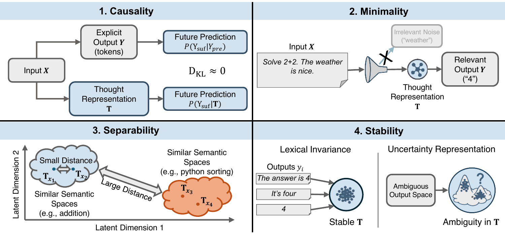

<div align="center">

# Formalizing Latent Thoughts:<br>Four Axioms of Thought Representation in LLMs

<a href="https://arxiv.org/abs/2606.27378"></a>
<a href="https://huggingface.co/papers/2606.27378"></a>
<a href="https://fard-lab.github.io/formalize-thoughts/"></a>
<a href="https://github.com/FARD-Lab/formalize-thoughts"></a>
<a href="https://x.com/HuggingPapers/status/2071640950628053248?s=20"></a>
<a href="https://www.linkedin.com/posts/fahd-seddik_artificialintelligence-largelanguagemodels-activity-7477185280475561984-PdWa"></a>
<a href="LICENSE"></a>

</div>

---

<p align="center">
  
</p>

---

## News

**[2026.06.29]** Our paper is featured as [🤗 HuggingFace #1 Paper of the Day](https://huggingface.co/papers/2606.27378)!

**[2026.06.29]** Covered by AK on [X / HuggingFace Daily Papers](https://x.com/HuggingPapers/status/2071640950628053248?s=20).

**[2026.06.29]** Paper launch: [X announcement](https://x.com/fahdseddik/status/2071422248745869680?s=20) and [LinkedIn post](https://www.linkedin.com/posts/fahd-seddik_artificialintelligence-largelanguagemodels-activity-7477185280475561984-PdWa).

**[2026.05.07]** We have released our paper on [arXiv](https://arxiv.org/abs/2606.27378)!

---

## Abstract

We introduce an axiomatic evaluation framework for latent thought representations in LLMs, comprising metrics that are independent of downstream benchmark scores and reveal representational failures that benchmark accuracy masks. Existing evaluations conflate representation quality with model capacity. Therefore, failures cannot be attributed to the representation rather than to the model that processes it. We formalize four functional axioms — **Causality**, **Minimality**, **Separability**, and **Stability** — and define a quantitative measure for each, computed directly on the representation independently of downstream accuracy. We audit open-weight LLMs across 23 reasoning tasks (e.g., Spatial Reasoning, Factual QA). We find that no candidate satisfies all four axioms simultaneously, that the representations distinguish task type reliably but cannot distinguish between two questions within the same task, and that the representations encode little information beyond what is already present in the input embedding. The failure is consistent across dense, reasoning-distilled, and RL-trained model families, indicating that the gap is structural rather than a property of model size or training procedure.

---

## Demo

<p align="center">
  <video src="https://github.com/user-attachments/assets/2a3ad3e9-b662-4cf4-9bbc-66e27591208f" controls width="300"></video>
</p>

---

## Requirements

**Python 3.12, CUDA 12.6, GCC 12.3.1.**

Install [uv](https://github.com/astral-sh/uv), then:

```bash
uv pip install torch
uv sync
```

Optional flash-attention support (set `CUDA_HOME` and add to `PATH` first):

```bash
uv pip install psutil ninja packaging einops setuptools wheel
uv pip install flash-attn --no-build-isolation
```

## Setup

Copy `.env.example` to `.env` and fill in your credentials:

```bash
cp .env.example .env
```

Download benchmarks before running the pipeline:

```bash
uv run python -m scripts.download.download_bbeh
```

---

## Pipeline

All scripts use [Hydra](https://hydra.cc) and must be run **from the project root** with `uv run python -m`. Phases must run in order: **1 → 2 → 3 → 4**, then minimality, causality, and DCS can run in any order after Phase 4.

### Phase 1 — LLM Data Generation

Generates LLM responses and first-token prefill hidden states for all 23 BBEH tasks.

```bash
# Llama-3.1-8B (default)
uv run python -m scripts.llm_data

# Other models — one config per model
uv run python -m scripts.llm_data --config-name=llm_data_70b
uv run python -m scripts.llm_data --config-name=llm_data_deepseek_r1_32b
uv run python -m scripts.llm_data --config-name=llm_data_skywork_or1_32b
uv run python -m scripts.llm_data --config-name=llm_data_gpt_oss_20b

# Quick smoke-test (10 examples, no wandb)
uv run python -m scripts.llm_data loader=dev wandb.use_wandb=false
```

Outputs land in `outputs/llm_data_<model>/`.

### Phase 2 — Discriminator Index

Builds positive/negative pair indices from Phase 1 outputs. Point `llm_data_output_dir` at the Phase 1 output.

```bash
uv run python -m scripts.disc_index \
    llm_data_output_dir=outputs/llm_data_8B
```

Outputs land in `outputs/disc_index_output/`.

### Phase 3 — Discriminator Training Data

Pre-generates cached TR vectors for all thought representation types. Must match the source model used in Phase 1.

```bash
# Llama-8B (hidden size 4096)
uv run python -m scripts.disc_data \
    llm_data_output_dir=outputs/llm_data_8B \
    disc_index_output_dir=outputs/disc_index_output

# Llama-70B (hidden size 8192)
uv run python -m scripts.disc_data \
    --config-name=disc_data \
    base_llm=llama_70b \
    llm_data_output_dir=outputs/llm_data_70b \
    discriminator.other_vector_dim=8192
```

Outputs land in `outputs/disc_data_<model>/`.

### Phase 4 — Discriminator Training (Separability)

Trains one discriminator per TR type. Key overrides: `tr_type`, `think_steps` (for soft/latent thinking), `source_hidden_size` (must match source model).

```bash
# Example: last_input_token on Llama-8B
uv run python -m scripts.disc_trainer \
    tr_type=last_input_token \
    disc_data_output_dir=outputs/disc_data_8B

# Example: soft_thinking at 128 steps
uv run python -m scripts.disc_trainer \
    tr_type=soft_thinking \
    think_steps=128 \
    disc_data_output_dir=outputs/disc_data_8B

# Example: Llama-70B (override hidden size and layer count)
uv run python -m scripts.disc_trainer \
    tr_type=last_input_token \
    source_hidden_size=8192 \
    source_num_layers=81 \
    disc_data_output_dir=outputs/disc_data_70b
```

Outputs land in `outputs/discriminator/`.

### Minimality Probe

Trains two probe families per TR type (both required for the IB-residual gap Delta_IB):

```bash
# Probe 1: predict Y from T  (ygt)
uv run python -m scripts.minimality_trainer \
    --config-name minimality_train_output \
    tr_type=last_input_token \
    llm_data_output_dir=outputs/llm_data_8B \
    tr_data_output_dir=outputs/disc_data_8B

# Probe 2: predict X from (Y, T)  (xgyt)
uv run python -m scripts.minimality_trainer \
    --config-name minimality_train_xgyt \
    tr_type=last_input_token \
    llm_data_output_dir=outputs/llm_data_8B \
    tr_data_output_dir=outputs/disc_data_8B
```

For soft/latent thinking, also pass `think_steps=128`. For non-8B models, also pass `probe.vector_dim=<hidden_size>` (70B → 8192, 32B → 5120).

Generate qualitative output samples:

```bash
uv run python -m scripts.minimality_samples
```

### Causality Evaluation

KL-substitution evaluation. Requires a trained discriminator from Phase 4. Use `tile_to_length=128` to match the paper's tiling protocol.

```bash
uv run python -m scripts.causality_eval \
    tr_type=last_input_token \
    disc_dir=outputs/discriminator/llama_8b/last_input_token \
    tr_data_dir=outputs/disc_data_8B \
    tile_to_length=128
```

To use the minimality projection (appendix ablation), add:

```bash
    proj_source=minimality_output \
    min_proj_run_label=<RUN_LABEL> \
    min_proj_root=outputs/min_prob_output
```

### DCS — Distributional Consistency Score

Requires a trained discriminator from Phase 4.

```bash
uv run python -m scripts.dcs_eval \
    tr_type=last_input_token \
    disc_dir=outputs/discriminator/llama_8b/last_input_token \
    tr_data_dir=outputs/disc_data_8B

uv run python -m scripts.dcs_d_eval \
    tr_type=last_input_token \
    tr_data_dir=outputs/disc_data_8B
```

---

## Thought Representation Types

| Code | Description |
|------|-------------|
| `last_input_token` | Hidden states from last prefill token, all layers |
| `last_input_hidden_state` | Single hidden state at last prefill token |
| `soft_thinking` | Iterative soft-thinking representations |
| `soft_thinking_noise` | Soft-thinking with noise injection |
| `latent_thinking` | Latent iterative representations |
| `embedding_no_pooling` | Per-beam text embeddings (no pooling) |
| `embedding_pooling` | Pooled text embeddings |
| `input_embedding` | Input-only text embeddings |
| `random_vector` | Random baseline |

---

## Running Tests

```bash
uv run pytest tests/
uv run pytest tests/test_phase2.py::TestName
```

---

## Citation

```bibtex
@misc{seddik2026formalizinglatentthoughtsaxioms,
  title         = {Formalizing Latent Thoughts: Four Axioms of Thought Representation in LLMs},
  author        = {Fahd Seddik and Fatemeh Fard},
  year          = {2026},
  eprint        = {2606.27378},
  archivePrefix = {arXiv},
  primaryClass  = {cs.CL},
  url           = {https://arxiv.org/abs/2606.27378}
}
```

---

## License

This project is released under the [MIT License](LICENSE).
